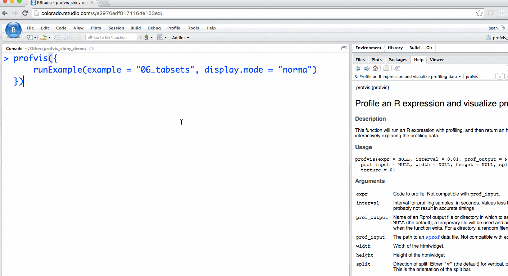

```{r echo = FALSE}
library(profvis)
library(knitr)

knitr::opts_chunk$set(collapse = TRUE, comment = "#>")

# Make output a little less tall by default
registerS3method("knit_print", "htmlwidget", function(x, ...) {
  # Get the chunk height
  height <- knitr::opts_current$get("height")
  if (length(height) > 0 && height != FALSE)
    x$height <- height
  else
    x$height <- "450px"

  htmlwidgets:::knit_print.htmlwidget(x, ...)
})
```


Below are some examples of profvis in use. Keep in mind that R's sampling profiler is non-deterministic, and that the code in these examples is run and profiled when this knitr document is executed, so the numeric timing values may not exactly match the text.


### Example 1

In this first example, we'll work with a data frame that has 151 columns. One of the columns contains an ID, and the other 150 columns contain numeric values. What we will do is, for each numeric column, take the mean and subtract it from the column, so that the new mean value of the column is zero.

```{r ex1}
# Generate data
times <- 4e5
cols <- 150
data <- as.data.frame(x = matrix(rnorm(times * cols, mean = 5), ncol = cols))
data <- cbind(id = paste0("g", seq_len(times)), data)

profvis({
  data1 <- data   # Store in another variable for this run

  # Get column means
  means <- apply(data1[, names(data1) != "id"], 2, mean)

  # Subtract mean from each column
  for (i in seq_along(means)) {
    data1[, names(data1) != "id"][, i] <- data1[, names(data1) != "id"][, i] - means[i]
  }
})
```

Most of the time is spent in the `apply` call, so that's the best candidate for a first pass at optimization. We can also see that the `apply` results in a lot of memory being allocated and deallocated. Memory "churning" is often a cause for performance problems.

Looking at the flame graph, we can see that `apply` calls `as.matrix` and `aperm`. These two functions convert the data frame to a matrix and transpose it -- so even before we've done any useful computations, we've spent a large amount of time transforming the data.

We could try to speed this up in a number of ways. One possibility is that we could simply leave the data in matrix form (instead of putting it in a data frame in line 4). That would remove the need for the `as.matrix` call, but it would still require `aperm` to transpose the data. It would also lose the connection of each row to the `id` column, which is undesirable. In any case, using `apply` over columns looks like it will be expensive because of the call to `aperm`.

An obvious alternative is to use the `colMeans` function. But there's also another possibility. Data frames are implemented as lists of vectors, where each column is one vector, so we could use `lapply` or `vapply` to apply the `mean` function over each column. Let's compare the speed of these four different ways of getting column means.

```{r ex1_apply}
profvis({
  data1 <- data
  # Four different ways of getting column means
  means <- apply(data1[, names(data1) != "id"], 2, mean)
  means <- colMeans(data1[, names(data1) != "id"])
  means <- lapply(data1[, names(data1) != "id"], mean)
  means <- vapply(data1[, names(data1) != "id"], mean, numeric(1))
})
```

`colMeans` is about 3x faster than using `apply` with `mean`, but it looks like it's still using `as.matrix`, which takes a significant amount of time. `lapply`/`vapply`are faster yet -- about 10x faster than `apply`. `lapply` returns the values in a list, while `vapply` returns the values in a numeric vector, which is the form that we want, so it looks like `vapply` is the way to go for this part.

(If you want finer-grained comparisons of code performance, you can use the [microbenchmark](https://cran.r-project.org/web/packages/microbenchmark/index.html) package. There's more information about microbenchmark in the  [profiling](http://adv-r.had.co.nz/Profiling.html#code-organisation) chapter of Hadley Wickham's book, *Advanced R*.)

You can also see that the faster methods also result in less memory allocation and deallocation. This is not a coincidence -- allocating and deallocating memory can be expensive.

Let's take the original code and replace `apply` with `vapply`:

```{r ex1_for}
profvis({
  data1 <- data
  means <- vapply(data1[, names(data1) != "id"], mean, numeric(1))

  for (i in seq_along(means)) {
    data1[, names(data1) != "id"][, i] <- data1[, names(data1) != "id"][, i] - means[i]
  }
})
```

Our code is about 3x faster than the original version. Most of the time is now spent on line 6, and the majority of that is in the `[<-.data.frame` function. This is usually called with syntax `x[i, j] <- y`, which is equivalent to `` `[<-`(x, i, j, y)``. In addition to being slow, the code is ugly: on each side of the assignment operator we're indexing into `data1` twice with `[`.

In this case, it's useful to take a step back and think about the broader problem. We want to normalize each column. Couldn't we we apply a function over the columns that does both steps, taking the mean and subtracting it? Because a data frame is a list, and we want to assign a list of values into the data frame, we'll need to use `lapply`.

```{r ex1_norm}
profvis({
  data1 <- data

  # Given a column, normalize values and return them
  col_norm <- function(col) {
    col - mean(col)
  }

  # Apply the normalizer function over all columns except id
  data1[, names(data1) != "id"] <- lapply(data1[, names(data1) != "id"], col_norm)
})
```

Now we have code that's not only about 6x faster than our original -- it's shorter and more elegant as well. Not bad! The profiler data helped us to identify performance bottlenecks, and understanding of the underlying data structures allowed us to approach the problem in a more efficient way.

Could we further optimize the code? It seems unlikely, given that all the time is spent in functions that are implemented in C (`mean` and `-`). That doesn't necessarily mean that there's no room for improvement, but this is a good place to move on to the next example.


### Example 2

This example addresses some more advanced issues. This time, it will be hard to directly see the causes of slowness, but we will be able to see some of their side-effects, most notably the side-effects from large amounts of memory allocation.

Suppose you have a data frame that contains a column for which you'd like to take a cumulative sum (and you don't know about R's built-in `cumsum` function). Here's one way to do it:

```{r ex2}
profvis({
  data <- data.frame(value = runif(5e4))

  data$sum[1] <- data$value[1]
  for (i in seq(2, nrow(data))) {
    data$sum[i] <- data$sum[i-1] + data$value[i]
  }
})
```

This takes about 2.5 seconds to calculate the cumulative sum of 50,000 items. That's pretty slow for a computer program. Looking at the profvis visualization, we can see a number of notable features:

Almost all the time is spent in one line of code, line 6. Although this is just one line of code, many different functions that are called on that line.

That line also results in a large amount of memory being allocated and deallocated, which is somewhat suprising: just looking at the code, that line *appears* to just modify the data in-place, but that's not actually what's happening internally.

In the flame graph, you'll see that some of the flame graph blocks have the label `$`, which means that those samples were spent in the `$` function for indexing into an object (in R, the expression `x$y` is equivalent to `` `$`(x, "y")``).

Because `$` is a *generic* function, it calls the corresponding *method* for the object, in this case `$.data.frame`. This function in turn calls `[[`, which calls `[[.data.frame`. (Zoom in to see this more clearly.)

Other flame graph cells have the label `$<-`. The usual syntax for calling this function is `x$y <- z`; this is equivalent to `` `$<-`(x, "y", z)``. (Assignment with indexing, as in `x$y[i] <- z` is actually a bit [more complicated](http://adv-r.had.co.nz/Functions.html#replacement-functions), and it turns out that this is the cause of the excessive memory allocation and deallocation.)

Finally, many of the flame graph cells contain the entire expression from line 6. This can mean one of two things:

1. R is currently evaluating the expression but is not inside another function call.
1. R is in another function, but that function does not show up on the stack. (A number of R's internal functions do not show up in the profiling data. See [more](#why-do-some-function-calls-not-show-in-the-profiler) about this in the FAQ.)

This profiling data tells us that much of the time is spent in `$` and `$<-`. Maybe avoiding these functions entirely will speed things up. To do that, instead of operating on data frame columns, we can operate on temporary vectors. As it turns out, writing a function that takes a vector as input and returns a vector as output is not only convenient; it provides a natural way of creating temporary variables so that we can avoid calling `$` and `$<-` in a loop.

```{r ex2_csum}
profvis({
  csum <- function(x) {
    if (length(x) < 2) return(x)

    sum <- x[1]
    for (i in seq(2, length(x))) {
      sum[i] <- sum[i-1] + x[i]
    }
    sum
  }
  x <- runif(5e5)
  x$sum <- csum(x)
})
```

Using this `csum` function, it takes about 100 ms for 10x as much data, which is about 250x as fast as before.

It may appear that no functions are called from line 7, but that's not quite true: that line also calls `[`, `[<-`, `-`, and `+`.

* The `[` and `[<-` functions don't appear in the flame graph. They are internal R functions which contain C code to handle indexing into atomic vectors, and are not dispatched to methods. (Contrast this with the first version of the code, where `$` was dispatched to `$.data.frame`).
* The `-` and `+` functions can show up in a flame graph, but they are very fast so the sampling profiler may or may not happen to take a sample when they're on the call stack.

The code panel shows that there is still a large amount of memory being allocated in the `csum` function. In the flame graph. you probably have noticed the gray blocks labeled `<GC>`. These represent times where R is doing *garbage collection* -- that is, when it is freeing (deallocating) chunks of memory that were allocated but no longer needed. If R is spending a lot of time freeing memory, that suggests that R is also spending a lot of time allocating memory. This is another common source of slowness in R code.

> **Note:** Before R 3.4, growing a vector in a loop was expensive -- each time the vector grew by one, R would copy the vector to a new block of memory, with the new item at the end. However, as of R 3.4, R tries to put vectors in a memory location with room to grow, and if there exists is only one reference to the vector, it can grow in place, except in the uncommon case where there's no more room to grow. (If there are two references to the vector, then R must make a copy.) This means that growing a vector is a fast operation, as long as there's only one reference to it.
>
> Although growing a vector is now fast, growing a **data frame** is still an expensive operation and results in copying all of the data.


### Example 3 - Profiling a Shiny Application

In addition to R code, you can also profile [Shiny](http://shiny.rstudio.com) applications. To do this, simply execute the `runApp()` command inside of `profvis`. For instance, we can run one of shiny's built-in examples using the `runExample` command (which is a wrapper for `runApp`).

```{r ex3,eval=FALSE, echo=FALSE}
#This code block is what we run, it must be manually run each time
library(shiny)
p<-profvis({
  runExample(example = "06_tabsets", display.mode = "normal")
})
saveRDS(p, "shinyapp.rds")

```


```{r ex3_tabsets,eval=FALSE}
library(shiny)
profvis({
  runExample(example = "06_tabsets", display.mode = "normal")
})
```


Your Shiny application will launch, and after interacting and closing the app a profile will be generated.



```{r ex3_readRDS,echo=FALSE}
# This block loads the data from the first block and shows the correct output
# for the readers.
readRDS("shinyapp.rds")

```

The profile for Shiny applications automatically hides functions that Shiny runs behind the scenes. More information is available in the [FAQ](http://rstudio.github.io/profvis/faq.html#why-does-the-flame-graph-hide-some-function-calls-for-shiny-apps). The profile automatically colors outputs in blue. In this example, you can identify each time `output$plot` was called to re-create the plot.

Profiling a Shiny application is particularly helpful for understanding reactive dependencies. For more information, see this [video](https://rstudio.com/resources/webinars/how-to-profile-and-optimize-code-using-profvis-a-new-package-for-exploring-profiling-data/).
