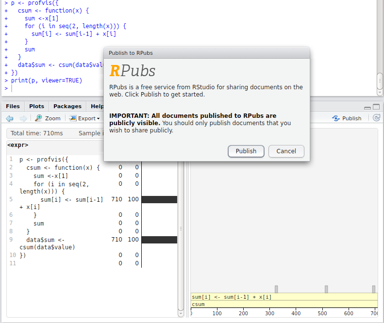

```{r echo = FALSE}
knitr::opts_chunk$set(collapse = TRUE, comment = "#>")
```

<style type="text/css">
img {
  box-shadow: 1px 2px 20px -5px;
}

/* Sizing for knitr documents */
.main-container {
 max-width: 100% !important;
}

.main-container > *, .main-container .section > * {
 max-width: 940px;
 margin-left: auto;
 margin-right: auto;
}

.main-container .profvis, .main-container .section {
 max-width: 100%
}

</style>


When it comes to making your R code faster, it's important to first find out what parts are slow, and then make those parts faster. It's common to rely on intuition and experience to guess at what is slow, but instead of relying on intuition, it's helpful to have tools for visualizing and exploring quantitative performance data.

Profvis provides an interface for exploring data from `Rprof`, R's built-in tool for collecting profiling data. In this document, we'll see how to use it, and walk though two examples where we use profvis to help us diagnose and fix performance problems.


## Getting started

To install profvis, first make sure you have the devtools package installed, then run:

```{r eval=FALSE}
devtools::install_github("rstudio/profvis")
```

Here's an example of profvis in use. We'll create a scatter plot of the `diamonds` data set, which has about 54,000 rows, fit a linear model, and draw a line for the model. (The plot isn't displayed in this document, though.) If you copy and paste this code into your R console, it'll open a new web browser with the same profvis interface that you see in this HTML document.

```{r fig.show="hide"}
library(profvis)

profvis({
  data(diamonds, package = "ggplot2")

  plot(price ~ carat, data = diamonds)
  m <- lm(price ~ carat, data = diamonds)
  abline(m, col = "red")
}, height = "250px")
```

In the profvis interface, on the left is the code, and on the right is a flame graph. If the panels are too narrow, using a wider browser window will help. In the flame graph, the horizontal direction represents time in milliseconds, and the vertical direction represents the call stack. Looking at the bottom-most items on the stack, most of the time, about 2 seconds, is spent in `plot`, and then a much smaller amount of time is spent in `lm`, and almost no time at all is spent in `abline` -- it doesn't even show up on the flame graph.

Traveling up the stack, `plot` called `plot.formula`, which called `do.call`, and so on. Going up a few more levels, we can see that `plot.default` called a number of functions: first `deparse`, and later, `plot.xy`. Similarly, `lm` calls a number of different functions.

On the left, we can see the amount of time spent on each line of code. This tells us, unsurprisingly, that most of the time is spent on the line with `plot`, and a little bit is spent on the line with `lm`.

### Navigating profvis

Profvis is interactive. You can try the following:

* As you mouse over the flame graph, information about each block will show in the info box.
* Yellow flame graph blocks have corresponding lines of code on the left. (White blocks represent code where profvis doesn't have the source code -- for example, in base R and in R packages. But see [this FAQ](#how-do-i-get-code-from-an-r-package-to-show-in-the-code-panel) if you want package code to show up in the code panel.) If you mouse over a yellow block, the corresponding line of code will be highlighted. Note that the highlighted line of code is where the yellow function is called *from*, not the content of that function.
* If you mouse over a line of code, all flame graph blocks that were called from that line will be highlighted.
* Click on a block or line of code to lock the current highlighting. Click on the background, or again on that same item to unlock the highlighting. Click on another item to lock on that item.
* Use the mouse scroll wheel or trackpad's scroll gesture to zoom in or out in the x direction.
* Click and drag on the flame graph to pan up, down, left, right.
* Double-click on the background to zoom the x axis to its original extent.
* Double-click on a flamegraph block to zoom the x axis the width of that block.

Each *block* in the flame graph represents a call to a function, or possibly multiple calls to the same function. The width of the block is proportional to the amount of time spent in that function. When a function calls another function, another block is added on top of it in the flame graph.

The profiling data has some limitations: some internal R functions don't show up in the flame graph, and it offers no insight into the code that's implemented in languages other than R (e.g. C, C++, or Fortran).


### How profiling data is collected

Profvis uses data collected by `Rprof`, which is part of the base R distribution. At each time interval (`profvis` uses a default interval of 10ms), the profiler stops the R interpreter, looks at the current function call stack, and records it to a file. Because it works by *sampling*, the result isn't deterministic. Each time you profile your code, the result will be slightly different.


## Profvis in practice

We'll use profvis to optimize some simple examples. Please keep in mind that R's sampling profiler is non-deterministic, and that the code in these examples is run and profiled when this knitr document is executed, so the numeric timing values may not exactly match the text.


### Example 1

In this first example, we'll work with a data frame that has 151 columns. One of the columns contains an ID, and the other 150 columns contain numeric values. What we will do is, for each numeric column, take the mean and subtract it from the column, so that the new mean value of the column is zero.

```{r}
# Generate data
times <- 4e5
cols <- 150
data <- as.data.frame(x = matrix(rnorm(times * cols, mean = 5), ncol = cols))
data <- cbind(id = paste0("g", seq_len(times)), data)

profvis({
  data1 <- data   # Store in another variable for this run

  # Get column means
  means <- apply(data1[, names(data1) != "id"], 2, mean)

  # Subtract mean from each column
  for (i in seq_along(means)) {
    data1[, names(data1) != "id"][, i] <- data1[, names(data1) != "id"][, i] - means[i]
  }
}, height = "400px")
```

Most of the time is spent in the `apply` call, so that's the best candidate for a first pass at optimization. `apply` calls `as.matrix` and `aperm`. These two functions convert the data frame to a matrix and transpose it -- so even before we've done any useful computations, we've spent a large amount of time transforming the data.

We could try to speed this up in a number of ways. One possibility is that we could simply leave the data in matrix form (instead of putting it in a data frame in line 4). That would remove for the `as.matrix` call, but it would still need `aperm` to transpose the data. It would also lose the connection of each row to the `id` column, which is undesirable. In any case, using `apply` over columns looks like it will be expensive because of the call to `aperm`.

An obvious alternative is to use the `colMeans` function. But there's also another possibility. Data frames are implemented as lists of vectors, where each column is one vector, so we could use `lapply` or `vapply` to apply the `mean` function over each column. Let's compare the speed of these four different ways of getting column means. 

```{r}
profvis({
  data1 <- data
  # Four different ways of getting column means
  means <- apply(data1[, names(data1) != "id"], 2, mean)
  means <- colMeans(data1[, names(data1) != "id"])
  means <- lapply(data1[, names(data1) != "id"], mean)
  means <- vapply(data1[, names(data1) != "id"], mean, numeric(1))
}, height = "300px")
```

`colMeans` is about 6x faster than using `apply` with `mean`, but it looks like it's still using `as.matrix`, which takes a significant amount of time. `lapply`/`vapply`are faster yet -- about 10x faster than `apply`. `lapply` returns the values in a list, while `vapply` returns the values in a numeric vector, which is the form that we want, so it looks like `vapply` is the way to go for this part.

(If you want finer-grained comparisons of code performance, you can use the [microbenchmark](https://cran.r-project.org/web/packages/microbenchmark/index.html) package. There's more information about microbenchmark in the  [profiling](http://adv-r.had.co.nz/Profiling.html#code-organisation) chapter of Hadley Wickham's book, Advanced R.)

Let's take the original code and replace `apply` with `vapply`:

```{r}
profvis({
  data1 <- data
  means <- vapply(data1[, names(data1) != "id"], mean, numeric(1))

  for (i in seq_along(means)) {
    data1[, names(data1) != "id"][, i] <- data1[, names(data1) != "id"][, i] - means[i]
  }
}, height = "300px")
```

Now our code is about 3x faster than the original version. Most of the time is spent on line 6, the majority of that in the `[<-` function. This function is usually called with syntax `x[i, j] <- y`, which is equivalent to `` `[<-`(x, i, j, y)``. In addition to being slow, the code is ugly: on each side of the assignment operator we're indexing into `data1` twice with `[`.

In this case, it's useful to take a step back and think about the broader problem. We want to normalize each column. Couldn't we we apply a function over the columns that does both steps, taking the mean and subtracting it? Because a data frame is a list, and we want to assign a list of values into the data frame, we'll need to use `lapply`.

```{r}
profvis({
  data1 <- data

  # Given a column, normalize values and return them
  col_norm <- function(col) {
    col - mean(col)
  }

  # Apply the normalizer function over all columns except id
  data1[, names(data1) != "id"] <- lapply(data1[, names(data1) != "id"], col_norm)
}, height = "350px")
```

Now we have code that's not only about 8x faster than our original -- it's shorter and more elegant as well. Not bad! The profiler data helped us to identify performance bottlenecks, and understanding of the underlying data structures allowed us to approach the problem in a more efficient way.

Could we further optimize the code? It seems unlikely, given that all the time is spent in functions that are implemented in C (`mean` and `-`). That doesn't necessarily mean that there's no room for improvement, but this is a good place to move on to the next example.


### Example 2

This example addresses some more advanced issues. This time, it will be hard to directly see the causes of slowness, but we will be able to see some of their side-effects, most notably the side-effects from large amounts of memory allocation.

Suppose you have a data frame that contains a column for which you'd like to take a cumulative sum (and you don't know about R's built-in `cumsum` function). Here's one way to do it:

```{r}
profvis({
  data <- data.frame(value = runif(3e4))

  data$sum[1] <- data$value[1]
  for (i in seq(2, nrow(data))) {
    data$sum[i] <- data$sum[i-1] + data$value[i]
  }
}, height = "350px")
```

This takes over 2 seconds to calculate the cumulative sum of 30,000 items. That's pretty slow for a computer program. Looking at the profvis visualization, we can see a number of notable features:

Almost all the time is spent in one line of code, line 6. Although this is just one line of code, many different functions that are called on that line.

In the flame graph, you'll see that some of the flame graph blocks have the label `$`, which means that those samples were spent in the `$` function for indexing into an object (in R, the expression `x$y` is equivalent to `` `$`(x, "y")``).

Because `$` is a *generic* function, it calls the corresponding *method* for the object, in this case `$.data.frame`. This function in turn calls `[[`, which calls `[[.data.frame`. (Zoom in to see this more clearly.)

Other flame graph cells have the label `$<-`. The usual syntax for calling this function is `x$y <- z`; this is equivalent to `` `$<-`(x, "y", z)``. (Assignment with indexing, as in `x$y[i] <- z` is actually a bit [more complicated](http://adv-r.had.co.nz/Functions.html#replacement-functions).)

Finally, many of the flame graph cells contain the entire expression from line 6. This can mean one of two things:

1. R is currently evaluating the expression but is not inside another function call.
1. R is in another function, but that function does not show up on the stack. (A number of R's internal functions do not show up in the profiling data. See [more](#why-do-some-function-calls-not-show-in-the-profiler) about this in the FAQ.)

This profiling data tells us that much of the time is spent in `$` and `$<-`. Maybe avoiding these functions entirely will speed things up. To do that, instead of operating on data frame columns, we can operate on temporary vectors. As it turns out, writing a function that takes a vector as input and returns a vector as output is not only convenient; it provides a natural way of creating temporary variables so that we can avoid calling `$` and `$<-` in a loop.

```{r}
profvis({
  csum <- function(x) {
    if (length(x) < 2) return(x)

    sum <- x[1]
    for (i in seq(2, length(x))) {
      sum[i] <- sum[i-1] + x[i]
    }
    sum
  }
  data$sum <- csum(data$value)
}, height = "320px")
```

Using this `csum` function, it takes just over half a second, which is about 4x as fast as before. 

It may appear that no functions are called from line 7, but that's not quite true: that line also calls `[`, `[<-`, `-`, and `+`.

* The `[` and `[<-` functions don't appear in the flame graph. They are internal R functions which contain C code to handle indexing into atomic vectors, and are not dispatched to methods. (Contrast this with the first version of the code, where `$` was dispatched to `$.data.frame`).
* The `-` and `+` functions can show up in a flame graph, but they are very fast so the sampling profiler may or may not happen to take a sample when they're on the call stack.

You probably have noticed the gray blocks labeled `<GC>`. These represent times where R is doing *garbage collection* -- that is, when it is freeing chunks of memory that were allocated but no longer needed. If R is spending a lot of time freeing memory, that suggests that R is also spending a lot of time allocating memory. This is another common source of slowness in R code.

In the `csum` function, `sum` starts as a length-1 vector, and then grows, in a loop, to be the same length as `x`. Every time a vector grows, R allocates a new block of memory for the new, larger vector, and then copies the contents over. The memory allocated for the old vector is no longer needed, and will later be garbage collected.

To avoid all that memory allocation, copying, and garbage collection, we can pre-allocate a correctly-sized vector for `sum`. For this data, that will result in 29,999 fewer allocations, copies, and deallocations.

```{r}
profvis({
  csum2 <- function(x) {
    if (length(x) < 2) return(x)

    sum <- numeric(length(x))  # Preallocate
    sum[1] <- x[1]
    for (i in seq(2, length(x))) {
      sum[i] <- sum[i-1] + x[i]
    }
    sum
  }
  data$sum <- csum2(data$value)
}, height = "350px")
```

This version of the code, with `csum2`, is around 60x faster than our original code. These performance improvements were possible by avoiding calls to `$` and `$<-`, and by avoiding unnecessary memory allocation from growing a vector in a loop.


## Frequently asked questions

### Why do some function calls not show in the profiler?

As noted earlier, some of R's built-in functions don't show in the profvis flame graph. These include functions like `<-`, `[`, and `$`. Although these functions can occupy a lot of time, they don't show on the call stack. (In one of the examples above, `$` does show on the call stack, but this is because it was dispatched to `$.data.frame`, as opposed to R's internal C code, which is used for indexing into lists.)

In some cases the side-effects of these functions can be seen in the flamegraph. As we saw in the example above, using these functions in a loop led to many memory allocations, which led to garbage collections, or `<GC>` blocks in the flame graph.

### How do I share a profvis visualization?

Right now the easiest way to do this is to run `profvis` in RStudio, and publish to [RPubs](http://rpubs.com/).

Normally profvis displays in a web browser, but in order to publish to RPubs, you'll need to make it display in the RStudio viewer. You can do this with `print(p, viewer = TRUE)`:

```{r eval=FALSE}
p <- profvis({
  # Interesting code here
})

# Open with RStudio viewer
print(p, viewer = TRUE)
```

Once it shows up in the viewer pane, click on the **Publish** button to send it to RPubs. You can see an example [here](http://rpubs.com/wch/124655). If you don't already have an account on RPubs, you'll need to set one up.



Another way to publish a profvis visualization is to save the HTML output file and put that on any web hosting service.

It's also possible to put a profvis visualization in a knitr document. At this time, some CSS workarounds are needed needed for them to display properly. You can look at the source of [this document](https://github.com/rstudio/profvis/tree/master/vignettes/intro.Rmd) to see the workarounds.


### What does `<Anonymous>` mean?

It's not uncommon for R code to contain *anonymous* functions -- that is, functions that aren't named. These show up as `<Anonymous>` in the profiling data collected from `Rprof`.

In the code below there is a function, `make_adder`, that returns a function. We'll invoke the returned function in two ways.

First, we'll run `make_adder(1)(10)`. The call `make_adder(1)` returns a function, which is invoked immediately (without being saved in a variable), and shows up as `<Anonymous>` in the flame graph.

Next, we'll call `make_adder(2)` but this time, we'll save the result in a variable, `adder2`. Then we'll call `adder2(10)`. When we do it this way, the profiler records that the function label is `adder2`.

```{r}
profvis({
  make_adder <- function(n) {
    function(x) {
      pause(0.25) # Wait for a moment so that this shows in the profiler
      x + n
    }
  }

  # Called with no intermediate variable, it shows as "<Anonymous>"
  make_adder(1)(10)

  # With the function saved in a variable, it shows as "adder2"
  adder2 <- make_adder(2)
  adder2(10)
}, height = "350px")
```

Similarly, functions that are accessed with `::` or `$` will also appear as `<Anonymous>`. The form `package::function()` is a common way to explicitly use a namespace to find a function. Similarly, the form `x$fun()` is a common way to call functions that are contained in a list, environment, reference class, or R6 object.

Those are equivalent to `` `::`(package, function)`` and `` `$`(x, "fun")``, respectively. These calls return anonymous functions, and so R's internal profiling code labels these as `<Anonymous>`. If you want labels in the profiler to have a different label, you can assign the value to a temporary variable (like `adder2` above), and then invoke that.

Finally, if a function is passed to `lapply`, it will be show up as `FUN` in the flame graph. If we inspect the source code for `lapply`, it's clear why: when a function is passed to `lapply`, the name used for the function inside of `lapply` is `FUN`.

```{r}
lapply
```


### How do I get code from an R package to show in the code panel?

In typical use, only code written by the user is shown in the code panel. (This is code for which *source references* are available.) Yellow blocks in the flame graph have corresponding lines of code in the code panel, and when moused over, the line of code will be highlighted. White blocks in the flame graph don't have corresponding lines in the code panel. In most cases, the calls represented by the white blocks are to functions that are in base R and other packages.

Profvis can also show code that's inside an R package. To do this, source refs for the package code must be available. There are two general ways to do this: you can install the package with source refs, or you can use `devtools::load_all()` to load a package from sources on disk.

#### Installing with source refs

There are many ways to install a package with source refs. Here are some examples of installing ggplot2:

* From CRAN:
    ```{r eval=FALSE}
    ## First, restart R ##
    install.packages("ggplot2", type="source", INSTALL_opts="--with-keep.source")
    ```

* From an RStudio package project on local disk: Go to **Build** -> **Configure Build Tools** -> **Build Tools** -> **Build and Reload -- R CMD INSTALL additional options**, and add `--with-keep.source`. Then run **Build** -> **Build and Reload**.

* From sources on disk with devtools:
    ```{r eval=FALSE}
    ## First, restart R ##
    # Assuming sources are in a subdirectory ggplot2/
    devtools::install("ggplot2", args="--with-keep.source")
    ```

* From sources on disk using the command line:
    ```{sh eval=FALSE}
    R CMD INSTALL --with-keep.source ggplot2/
    ```

* From sources on Github:
    ```{r eval=FALSE}
    ## First, restart R ##
    devtools::install_github("hadley/ggplot2", args="--with-keep.source")
    ```

#### Loading packages with source refs (without installing)

* Instead of installing an in-development package, you can simply load it from source using devtools.
    ```{r eval=FALSE}
    # Assuming sources are in a subdirectory ggplot2/
    devtools::load_all("ggplot2")
    ```

Once a package is loaded or installed with source refs, profvis visualizations will display source code for that package. For example, the visualization below has yellow blocks for both user code and for code in ggplot2, and it contains ggplot2 code in the code panel:

```{r fig.show="hide"}
library(ggplot2)
profvis({
  g <- ggplot(diamonds, aes(carat, price)) + geom_point(size = 1, alpha = 0.2)
  print(g)
})
```


### Why does the flame graph hide some function calls?

The flame graph will, by default, hide some function calls. They're hidden because they aren't particularly informative for optimizing code, and they add visual complexity. For example, `try`, `tryCatch`, and related functions are hidden by default.

If you want to see these hidden blocks, uncheck **Settings** -> **Hide internal functions**:

```{r fig.show="hide"}
profvis({
  try_seq_len <- function(n) {
    try({
      seq_len(n)
    }, silent = TRUE)
  }
  for (i in runif(1e4, min = -10, max = 100)) {
    try_seq_len(i)
  }
}, height = "300px")
```

You can see the list of hidden items [here](https://github.com/rstudio/profvis/blob/master/R/collapse.R#L3-L20). This list may change in the near future.


### Why does `Sys.sleep()` not show up in profiler data?

The R profiler doesn't provide any data when R makes a system call. If, for example, you call `Sys.sleep(5)`, the R process will pause for 5 seconds, but you probably won't see any instances of `Sys.sleep` in the profvis visualization -- it won't even take any horizontal space. For these examples, we've used the `pause` function instead, which is part of the profvis package. It's similar to `Sys.sleep`, except that it does show up in the profiling data. For example:

```{r}
profvis({
  # Does not show in the flame graph
  Sys.sleep(0.25)

  # Does show in the flame graph
  pause(0.25)
})
```

Calls to external programs and libraries also may not show up in the profiling data. If you call functions from a package to fetch data from external sources, keep in mind that time spent in those functions may not show in the profiler.


### Why is the call stack reversed for some of my code?

One of the unusual features of R as a programming language is that it has *lazy evaluation* of function arguments. If you pass an expression to a function, that expression won't be evaluated until it's actually used somewhere in that function.

The result of this is that sometimes the stack can look like it's in the wrong order. In this example below, we call `times_10` and `times_10_lazy`. They both call `times_5()` and `times_2()`, but the "regular" version uses an intermediate variable `y`, while the lazy version nests the calls, with `times_2(times_5(x))`.

```{r}
profvis({
  times_5 <- function(x) {
    pause(0.5)
    x * 5
  }

  times_2 <- function(x) {
    pause(0.2)
    x * 2
  }

  times_10 <- function(x) {
    y <- times_5(x)
    times_2(y)
  }

  times_10_lazy <- function(x) {
    times_2(times_5(x))
  }

  times_10(10)
  times_10_lazy(10)
}, height = "350px")
```

In most programming languages, the flame graph would look the same for both: the `times_10` (or `times_10_lazy`) block would be on the bottom, with `times_5` and `times_2` side-by-side on the next level up on the stack.

With lazy evaluation, when the `times_10_lazy` function calls `times_2(times_5(x))`, the `times_2` function receives a *promise* with the unevaluated expression `times_5(x)`, and evaluates it only when it reaches line 9, `x * 2` (the expression gets evaluated in the correct context, so there's no naming collision of the `x` variable).

It's not only the call stack that has a surprising order with `times_10_lazy` -- the temporal order the simulated work we're doing in the function (represented by the `pause` blocks) is different. The `times_2` and `times_5` functions pause for 0.2 and 0.5 seconds, respectively. Those pauses occur in opposite order in `times_10` and `times_10_lazy`.

Keep in mind that lazy evaluation may result in counterintuitive results in the flame graph. If you want to avoid some of the possible confusion from lazy evaluation, you can use intermediate variables to force the evaluation of arguments at specific locations in your code, as we did in `times_10`.

### Why does profvis tell me the the wrong line is taking time?

In some cases, multi-line expressions will report that the first line of the expression is the one that takes all the time. In the example below, there are two `for` loops: one with curly braces, and one without. In the loop with curly braces, it reports that line 3, containing the `pause` is the one that takes all the time. In the loop without curly braces, it reports that line 6, containing `for`, is the one that takes all the time, even though the time is really spent on line 7, with the `pause`.

```{r}
profvis({
  for (i in 1:3) {
    pause(0.1)
  }

  for (i in 1:3)
    pause(0.1)

}, height = "250px")
```

For code that contains multi-line expressions like these, using curly braces will allow the profiler to identify the correct line where code is running.
